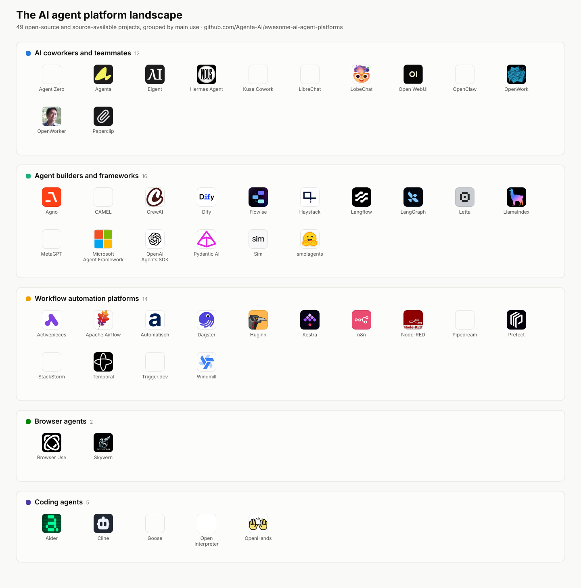

# Awesome AI Agent Platforms 

> A curated list of open-source AI agent platforms: AI coworkers and teammates, agent builders and frameworks, workflow automation platforms, browser agents, and coding agents, with license and hosting notes for every entry.

AI coworkers are persistent agents that people delegate real work to: they sign in to tools, keep context, run on schedules, and come back with finished work. This list covers the platforms that provide them, the frameworks developers build them with, and the automation and specialist agents around them.

Browse this list as a website with a full comparison table at [aiagentplatforms.dev](https://aiagentplatforms.dev).

## Contents

- [AI coworkers and teammates](#ai-coworkers-and-teammates)
- [Agent builders and frameworks](#agent-builders-and-frameworks)
- [Workflow automation platforms](#workflow-automation-platforms)
- [Browser agents](#browser-agents)
- [Coding agents](#coding-agents)
- [Selection criteria](#selection-criteria)
- [Contributing](#contributing)
- [License](#license)

## AI coworkers and teammates

Platforms that give an individual or a team persistent agents they can delegate work to through chat, a desktop, or a shared workspace.

- [Agent Zero](https://github.com/frdel/agent-zero) - Personal agent with a Linux desktop, browser, files, skills, and plugins. License: MIT. Hosting: self-hosted with Docker; desktop launcher available.
- [Agenta](https://github.com/agenta-ai/agenta) - Workspace for building AI coworkers and automations through chat, sharing them with a team, and running them interactively or in the background. License: MIT core, separately licensed enterprise features. Hosting: self-hosted; hosted service available.
- [Eigent](https://github.com/eigent-ai/eigent) - Desktop application for building and managing a workforce of agents that completes multi-step tasks. License: Apache-2.0. Hosting: local desktop.
- [Hermes Agent](https://github.com/NousResearch/hermes-agent) - Personal agent with memory, skills, tools, scheduled jobs, and messaging channels. License: MIT. Hosting: self-hosted; desktop application available.
- [Kuse Cowork](https://github.com/kuse-ai/kuse_cowork) - Local-first desktop coworker that works across documents and tasks with user-selected models. License: MIT. Hosting: local desktop; optional Docker isolation.
- [LibreChat](https://github.com/danny-avila/LibreChat) - Multi-model AI workspace with agents, tools, memory, code execution, and shared access controls. License: MIT. Hosting: self-hosted.
- [LobeChat](https://github.com/lobehub/lobe-chat) - Multi-model agent workspace with knowledge bases, plugins, and one-click or Docker deployment. License: LobeHub Community License (source-available). Hosting: self-hosted or vendor-hosted.
- [Open WebUI](https://github.com/open-webui/open-webui) - Extensible AI workspace for local and cloud models with knowledge, tools, and offline operation. License: Open WebUI License (source-available). Hosting: self-hosted; vendor-hosted available.
- [OpenClaw](https://github.com/openclaw/openclaw) - Assistant that connects models, tools, messaging channels, and companion applications through one gateway. License: MIT. Hosting: self-hosted on a device or server.
- [OpenWork](https://github.com/different-ai/openwork) - Desktop workspace for using and sharing agent workflows across files and connected services. License: mixed, open-source and separately licensed portions. Hosting: local desktop or organization-managed.
- [OpenWorker](https://github.com/andrewyng/openworker) - Desktop coworker that completes everyday tasks across files, applications, and Slack. License: MIT. Hosting: local desktop.
- [Orkas](https://github.com/Orkas-AI/Orkas) - Local-first desktop AI workforce whose Commander coordinates specialist agents through one chat. License: MIT. Hosting: local desktop.
- [Paperclip](https://github.com/paperclipai/paperclip) - Control plane for assigning goals, roles, budgets, and work to teams of external agents. License: MIT. Hosting: self-hosted.

## Agent builders and frameworks

Frameworks and visual tools developers use to create, connect, run, and inspect agents.

- [Agno](https://github.com/agno-agi/agno) - Python framework and runtime for building agents, serving them through an API, and managing them in a web interface. License: Apache-2.0. Hosting: self-hosted; vendor cloud available.
- [CAMEL](https://github.com/camel-ai/camel) - Python framework for researching and building agents, multi-agent systems, tasks, and simulated environments. License: Apache-2.0. Hosting: library for self-managed applications.
- [CrewAI](https://github.com/crewAIInc/crewAI) - Python framework for coordinating role-based agents and structured task flows. License: MIT. Hosting: self-hosted framework; vendor platform available.
- [Dify](https://github.com/langgenius/dify) - Platform for building AI workflows, retrieval pipelines, and agentic applications with broad model support. License: Dify Open Source License (Apache-2.0 based, with conditions). Hosting: self-hosted; vendor cloud available.
- [Flowise](https://github.com/FlowiseAI/Flowise) - Visual builder for agents and language-model workflows. License: Apache-2.0 core, separately licensed enterprise features. Hosting: self-hosted; vendor cloud available.
- [Haystack](https://github.com/deepset-ai/haystack) - Python framework for production retrieval, document-processing pipelines, and agents. License: Apache-2.0. Hosting: library for self-managed applications; vendor cloud available.
- [Langflow](https://github.com/langflow-ai/langflow) - Visual and code-based platform for building agents and workflows that run as APIs or MCP servers. License: MIT. Hosting: self-hosted; vendor-hosted available.
- [LangGraph](https://github.com/langchain-ai/langgraph) - Low-level framework for long-running, stateful agents with explicit control over the execution graph. License: MIT. Hosting: library for self-managed applications; vendor platform available.
- [Letta](https://github.com/letta-ai/letta) - Framework and server for stateful agents with persistent memory. License: Apache-2.0. Hosting: self-hosted server; vendor-hosted available.
- [LlamaIndex](https://github.com/run-llama/llama_index) - Framework for building agentic applications over documents and data, with parsing, extraction, and multi-agent workflows. License: MIT. Hosting: library for self-managed applications; vendor cloud available.
- [MetaGPT](https://github.com/geekan/MetaGPT) - Python multi-agent framework that models software and business roles as coordinated agent workflows. License: MIT. Hosting: library for self-managed applications.
- [Microsoft Agent Framework](https://github.com/microsoft/agent-framework) - Framework for building and coordinating agents across Python and .NET applications. License: MIT. Hosting: library for self-managed or cloud applications.
- [OpenAI Agents SDK](https://github.com/openai/openai-agents-python) - Python framework for agent and multi-agent workflows with tools, handoffs, guardrails, sessions, and tracing. License: MIT. Hosting: library for self-managed applications.
- [Pydantic AI](https://github.com/pydantic/pydantic-ai) - Typed Python agent framework with model portability, tools, and durable execution. License: MIT. Hosting: library for self-managed applications; vendor platform available.
- [Sim](https://github.com/simstudioai/sim) - Collaborative visual workspace for building, deploying, and monitoring agents and workflows. License: Apache-2.0. Hosting: self-hosted; vendor cloud available.
- [smolagents](https://github.com/huggingface/smolagents) - Compact Python library for agents that act through code or tool calls. License: Apache-2.0. Hosting: library for self-managed applications.

## Workflow automation platforms

Platforms and runtimes for repeatable workflows, scheduled jobs, and event-driven processes, with or without AI steps.

- [Activepieces](https://github.com/activepieces/activepieces) - Visual automation platform with integrations, AI steps, and a TypeScript extension framework. License: MIT core, separately licensed enterprise features. Hosting: self-hosted or vendor cloud.
- [Apache Airflow](https://github.com/apache/airflow) - Python platform for developing, scheduling, and monitoring batch workflows as code. License: Apache-2.0. Hosting: self-hosted; third-party managed services available.
- [Automatisch](https://github.com/automatisch/automatisch) - Visual business-automation tool for connecting services and running workflows without code. License: AGPL-3.0 core, separately licensed enterprise files. Hosting: self-hosted; vendor cloud available.
- [Dagster](https://github.com/dagster-io/dagster) - Python orchestrator for building and operating data assets, pipelines, and automation. License: Apache-2.0. Hosting: self-hosted; vendor cloud available.
- [Huginn](https://github.com/huginn/huginn) - System of agents that monitors events and performs actions on a schedule or in response to changes. License: MIT. Hosting: self-hosted.
- [Kestra](https://github.com/kestra-io/kestra) - Workflow orchestration platform for data, infrastructure, and AI processes defined in code or a UI. License: Apache-2.0 core, separately licensed enterprise features. Hosting: self-hosted or vendor cloud.
- [n8n](https://github.com/n8n-io/n8n) - Visual platform for connecting applications and building workflows that can include code and AI agents. License: Sustainable Use License (fair-code, source-available). Hosting: self-hosted or vendor cloud.
- [Node-RED](https://github.com/node-red/node-red) - Flow-based programming tool for connecting devices, APIs, and online services. License: Apache-2.0. Hosting: self-hosted.
- [Pipedream](https://github.com/PipedreamHQ/pipedream) - Event-driven automation platform with prebuilt integrations and steps in Node.js, Python, Go, or Bash. License: Pipedream Source Available License. Hosting: vendor-hosted.
- [Prefect](https://github.com/PrefectHQ/prefect) - Python framework for building, deploying, and observing workflows with schedules and event triggers. License: Apache-2.0. Hosting: self-hosted server or vendor cloud.
- [StackStorm](https://github.com/StackStorm/st2) - Event-driven automation platform that connects services and takes actions through rules and workflows. License: Apache-2.0. Hosting: self-hosted.
- [Temporal](https://github.com/temporalio/temporal) - Durable execution platform that preserves application state and retries workflow steps through failures. License: MIT. Hosting: self-hosted or vendor cloud.
- [Trigger.dev](https://github.com/triggerdotdev/trigger.dev) - TypeScript platform for background jobs, workflows, and long-running AI tasks. License: Apache-2.0. Hosting: self-hosted or vendor cloud.
- [Windmill](https://github.com/windmill-labs/windmill) - Developer platform that turns scripts into APIs, background jobs, workflows, and internal applications. License: AGPL-3.0 and Apache-2.0 core, separately licensed enterprise features. Hosting: self-hosted or vendor cloud.

## Browser agents

Agents specialized in operating web browsers and automating tasks on websites.

- [Browser Use](https://github.com/browser-use/browser-use) - Python library that lets agents control web browsers and automate online tasks. License: MIT. Hosting: self-hosted; vendor cloud available.
- [Skyvern](https://github.com/Skyvern-AI/skyvern) - Browser automation platform that uses agents and computer vision to complete website workflows. License: AGPL-3.0. Hosting: self-hosted; vendor cloud available.

## Coding agents

Agents specialized in writing, editing, and shipping code.

- [Aider](https://github.com/Aider-AI/aider) - Terminal-based AI pair programming tool for creating and editing codebases with many model providers. License: Apache-2.0. Hosting: runs locally in the terminal.
- [Cline](https://github.com/cline/cline) - Autonomous coding agent available as an IDE extension, CLI, and SDK. License: Apache-2.0. Hosting: runs locally in the IDE or terminal.
- [Goose](https://github.com/block/goose) - Coding agent from Block that runs locally as a CLI or desktop application and extends beyond code tasks. License: Apache-2.0. Hosting: runs locally.
- [Open Interpreter](https://github.com/openinterpreter/open-interpreter) - Coding agent optimized for low-cost models that emulates multiple agent harnesses. License: Apache-2.0. Hosting: runs locally.
- [OpenHands](https://github.com/All-Hands-AI/OpenHands) - Platform for software development agents that runs coding agents across local, remote, and cloud backends. License: MIT. Hosting: self-hosted; vendor cloud available.

## Selection criteria

An entry must:

- Have an active official repository or product page that clearly explains what it does.
- Offer a usable product, framework, or runtime. Demo-only repositories and resource lists do not qualify.
- State enough public information to verify its license and hosting model.
- Be maintained. Discontinued projects and repositories that point new users to a successor do not qualify.

Each project appears once, under the category that best matches its main use. License and hosting notes reflect the linked repository at the time of the last verification. Inclusion is not an endorsement, and star counts, funding, and company size are not criteria.

## Contributing

Contributions are welcome. Open a pull request that adds or changes one entry at a time:

1. Add the entry to the category that best matches its main use, in alphabetical order.
2. Link to the official repository, or the official product page only when no canonical repository exists.
3. Write one factual sentence about what the tool does. No slogans, star counts, or comparisons.
4. State the current license and hosting model in the same bullet.
5. Confirm the project meets the [selection criteria](#selection-criteria).

## License

Released under [CC0 1.0](LICENSE). To the extent possible under law, the maintainers have waived all copyright and related rights to this work.
